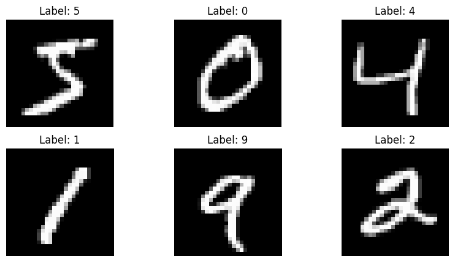
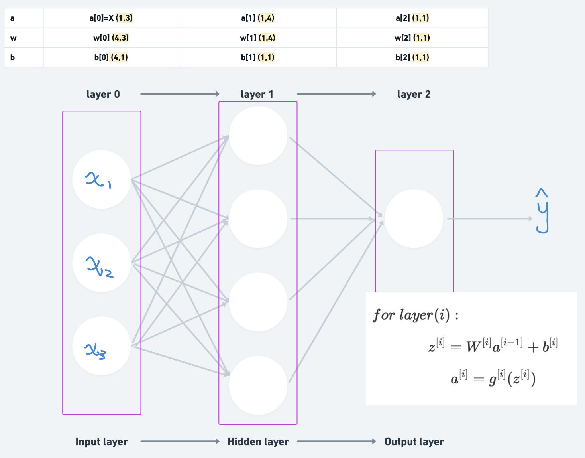

# 手写数字神经网络机器学习

[](https://gitcode.com/qq_55297504/handwritten_digits/overview)

> [参考文章](http://neuralnetworksanddeeplearning.com/chap1.html)
> 这是一个机器学习大神写的关于神经网络实现手写数字识别的文章，里面有详细的介绍和代码实现。
> [参考视频](https://www.bilibili.com/video/BV1bx411M7Zx/?spm_id_from=333.999.0.0)
> 这个是 3b1b 这个著名的可视化教程博主做的相关视频。好康！

手写数字识别是一个经典的机器学习问题，它的目标是识别手写数字，即输入一张图片，输出它代表的数字。可以说是机器学习的`hello world`了。我想主要写这个文章来总结一下这个过程当中的推导和相应的代码编写。

**为获得更好的学习效果，可以 clone 我放在 GitCode 的[MNIST 手写数字识别](https://gitcode.com/qq_55297504/handwritten_digits/overview)项目，然后按照里面的 jupyter notebook 来运行。**

---

## 数据集总览

数据采用的是 MNIST 数据集，它是一个手写数字的图像数据集。来自于[数据集网站](https://yann.lecun.com/exdb/mnist/)。由于官方网站数据不好下载，**我把所有相关代码和数据都放在 GitCode 上了，大家可以直接 clone 下来运行。**

可以看到数据集一共有四个文件：
`train-images.idx3-ubyte`：训练集图像
`train-labels.idx1-ubyte`：训练集标签
`t10k-images.idx3-ubyte`：测试集图像
`t10k-labels.idx1-ubyte`：测试集标签

> 这种文件格式是由 Yann LeCun 等人设计的，常用于存储图像数据集的标签，例如 MNIST 手写数字数据集。这种文件格式的设计是为了高效地存储和传输大量数据。由于它是二进制格式，所以比文本格式更紧凑，占用的空间更小，读取速度也更快。

我选择用`idx2numpy`库来读取 MNIST 数据集，它可以将 MNIST 数据集转换为 numpy 数组。

```python
train_labels = idx2numpy.convert_from_file('./mnist_data/train-labels.idx1-ubyte')
train_images = idx2numpy.convert_from_file('./mnist_data/train-images.idx3-ubyte')
test_labels = idx2numpy.convert_from_file('./mnist_data/t10k-labels.idx1-ubyte')
test_images = idx2numpy.convert_from_file('./mnist_data/t10k-images.idx3-ubyte')

print("Number of train labels:", train_labels.shape)# Number of labels: (60000,)
print("First 10 train labels:", train_labels[:10])# First 10 labels: [5 0 4 1 9 2 1 3 1 4]
print("Number of train images:", train_images.shape)# Number of images: (60000, 28, 28)
print("Number of test labels:", test_labels.shape)# Number of test labels: (10000,)
```

可以看到**训练**数据集一共有 60000 条数据。相应的训练图像是 28\*28 的灰度图像，标签是 0-9 的数字。测试数据集一共有 10000 条数据。

出于好奇心我们画一个图像看看：

```python
import numpy as np
import matplotlib.pyplot as plt
num_images_to_display = 6
fig, axes = plt.subplots(2, 3, figsize=(10, 5))
for i in range(num_images_to_display):
    ax = axes[i // 3, i % 3]
    ax.imshow(images[i], cmap='gray')
    ax.set_title(f'Label: {labels[i]}')
    ax.axis('off')

plt.show()
```



嗯，不错，长这个样子。

---

## 神经网络模型概述

这篇文章是建立在大家有一定神经网络原理基础的前提下，所以我不会过多介绍神经网络的原理。如果有疑问可以去看看吴恩达的[神经网络和深度学习](https://www.bilibili.com/video/BV1FT4y1E74V?spm_id_from=333.788.videopod.episodes&vd_source=99679695e411b84c81acc14985c7f552&p=8)课程。

这里简单总结一下



| 符号        | 含义                             |
| ----------- | -------------------------------- |
| $n^{[i]}$   | 第 $i$ 层的神经元个数            |
| $a^{[i]}_j$ | 第 $i$ 层第 $j$ 个神经元的激活值 |
| $z^{[i]}_j$ | 第 $i$ 层第 $j$ 个神经元的输入值 |
| $w^{[i]}_j$ | 第 $i$ 层第 $j$ 个神经元的权重   |
| $b^{[i]}_j$ | 第 $i$ 层第 $j$ 个神经元的偏差   |
| $X^{[i]}$   | 第 $i$ 层的输入数据              |

简单的来说，我们在这一个项目里想要达到的效果是: **训练出一些权重值$w$和偏差值$b$，从而构建一个神经网络，可以将图片输入进去，并输出一个对应的识别数字。** 这就相当于一个函数一样，有输入有输出，只不过你很难用公式来表示它。

具体的得到权重偏差这些参数的过程就是我们学习神经网络的重点。我们会用到**梯度下降法**这个经典的方法去更新这些参数，使得神经网络的输出结果更加准确。而我们用于衡量准确度的指标就是**损失函数**，它衡量了神经网络的输出结果与真实结果之间的差距。由于研究问题性质不同，我们可能要输出的是一个概率分布，而不是一个具体的数字。所以我们还需要用**Sigmoid 这样的激活函数**来将输出值转换为概率。

---

## 神经网络实现

**1.神经网络的初始化**
训练神经网络前，我们需要初始化一些向量组，包括权重$w$和偏差$b$。这些向量组的维度和神经网络的层数有关，我们可以根据经验设置。

我们可以用下面的代码来初始化一些参数：

```python
class network(object):
    def __init__(self,sizes) -> None:
        self.num_layers = len(sizes)
        self.sizes = sizes
        self.biases = [np.random.randn(y,1) for y in sizes[1:]]
        self.weights = [np.random.randn(y,x) for y,x in zip(sizes[1:],sizes[:-1])]
```

**2.前向传播**

前向传播是指神经网络从输入层到输出层的过程。我们可以用下面的代码来实现：

```python
def feedforward(self,a):
    for b , w in zip(self.biases,self.weights):
        a = sigmoid(np.dot(w,a)+b)
    return a
```

**3.激活函数**

激活函数是神经网络的关键，它决定了神经网络的输出结果。我们可以用 `sigmoid` 函数来实现，并且我们还需要计算它的导数 `sigmoid_prime` 。

```python
def sigmoid(z):
    return 1.0/(1.0+np.exp(-z))
def sigmoid_prime(z):
    return sigmoid(z)*(1-sigmoid(z))
```

**4.损失函数**

```python
def cost_derivative(self, output_activations, y):
    return (output_activations-y)
```

**5.反向传播**

反向传播是指神经网络从输出层到输入层的过程。主要是为了更新权重和偏差。我们可以用下面的代码来实现：

```python
def backprop(self, x, y):
    nabla_b = [np.zeros(b.shape) for b in self.biases]
    nabla_w = [np.zeros(w.shape) for w in self.weights]
    activation = x
    activations = [x] # 一个列表，用于存储每一层的激活值
    zs = [] # 一个列表，用于存储每一层的输入值

    # 前向传播
    for b, w in zip(self.biases, self.weights):
        z = np.dot(w, activation)+b
        zs.append(z) # 存储每一层的输入值
        activation = sigmoid(z)
        activations.append(activation) # 存储每一层的激活值

    # 反向传播
    delta = self.cost_derivative(activations[-1], y) * sigmoid_prime(zs[-1]) # 计算最后一层的delta
    nabla_b[-1] = delta
    nabla_w[-1] = np.dot(delta, activations[-2].transpose())

    for l in range(2, self.num_layers):
        z = zs[-l]
        sp = sigmoid_prime(z)
        delta = np.dot(self.weights[-l+1].transpose(), delta) * sp
        nabla_b[-l] = delta
        nabla_w[-l] = np.dot(delta, activations[-l-1].transpose())
    return (nabla_b, nabla_w)
```

**6.更新权重和偏差**

```python
def update_mini_batch(self, mini_batch, eta):
    '''
        更新批次数据内的bias和wieght
    '''
    nabla_b = [np.zeros(b.shape) for b in self.biases]
    nabla_w = [np.zeros(w.shape) for w in self.weights]
    for x, y in mini_batch:
        delta_nabla_b, delta_nabla_w = self.backprop(x, y)
        nabla_b = [nb+dnb for nb, dnb in zip(nabla_b, delta_nabla_b)]
        nabla_w = [nw+dnw for nw, dnw in zip(nabla_w, delta_nabla_w)]
    self.weights = [w-(eta/len(mini_batch))*nw for w, nw in zip(self.weights, nabla_w)]
    self.biases = [b-(eta/len(mini_batch))*nb for b, nb in zip(self.biases, nabla_b)]
```

**7.测试数据集**

我们还可以用测试数据集来评估每次更新后的神经网络的准确度。

```python
def evaluate(self, test_data):
    test_results = [(np.argmax(self.feedforward(x)), y) for (x, y) in test_data]
    return sum(int(x == y) for (x, y) in test_results)
```

**8.神经网络搭建**

最后，我们可以用上面的代码来搭建一个神经网络。

```python
class network(object):
    def __init__(self,sizes) -> None
    def feedforward(self,a)
    def update_mini_batch(self, mini_batch, eta)
    def evaluate(self, test_data)
    def backprop(self, x, y)
    def cost_derivative(self, output_activations, y)
    def SGD(self,training_data,epoches,mini_batch_size,eta,test_data=None):
        if test_data: n_test = len(test_data)
        n = len(training_data)
        for j in range(epoches):
            random.shuffle(training_data)
            mini_batches = [training_data[k:k+mini_batch_size] for k in range(0, n, mini_batch_size)]
            for mini_batch in mini_batches:
                self.update_mini_batch(mini_batch, eta)
            if test_data:
                print ("Epoch {0}: {1} %".format(j+1, 100*self.evaluate(test_data)/n_test))
            else:
                print ("Epoch {0} complete".format(j))
```

---

## 数据预处理

为了让 label 更适合向量计算，我们可以将 label 转换为 one-hot 编码。如下：

```python
def vectorized_result(j):
    e = np.zeros((10, 1))
    e[j] = 1.0
    return e

training_inputs = [np.reshape(x, (784, 1)) for x in train_images]
training_results = [vectorized_result(y) for y in train_labels]
train_data = list(zip(training_inputs, training_results))
```

`vectorized_result(y)`函数将每个标签转换为一个 10 维的向量，表示为`one-hot`编码（即只在对应数字的索引位置为 1，其他位置为 0），这样可以更有效地进行分类。

现在，`train_data`是一个列表，包含训练集的输入和输出。它的元素由`(x, y)`组成，`x`是一个 784 维的向量，`y`是一个 10 维的向量。

同样的，test_data 也需要进行预处理：

```python
test_inputs = [np.reshape(x, (784, 1)) for x in test_images]
test_data = list(zip(test_inputs, test_labels))
```

---

## 训练神经网络

最后，我们可以用上面的代码来训练神经网络。

```python
net = network([784,30,10])
net.SGD(train_data, 30, 10, 0.1, test_data=test_data)
```

这里，我们设置了 30 个 epoch，每批次 10 个样本，学习率为 0.1。选择使用两层神经网络，一层有 30 个神经元，另一层有 10 个神经元。

---

## 应用神经网络

训练完成后，我们可以利用`feedforward`函数用训练好的神经网络来识别手写数字，用此网络实现一个手写数字识别的应用。

相关代码`application.py`我已经放在 GitCode 上了，大家可以 clone 下来运行。

---

## 后续

这篇文章主要介绍了神经网络的基本原理和实现，以及如何用 MNIST 数据集训练一个神经网络来识别手写数字。在写这篇文章的时候，我个人也是初次接触这个项目，所以文章中难免有些地方还需要进一步的补充和完善，同时，个人也产生了一些疑问，会在后续文章中解决。

- 如何确定最佳的学习率？
- 其他人是怎么做的？
- 有没有更多的指标函数来控制神经网络的学习？
